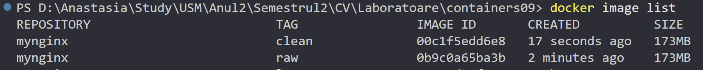
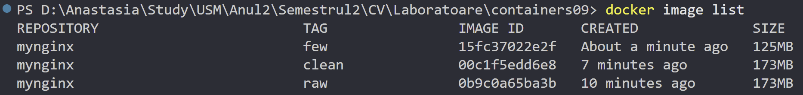
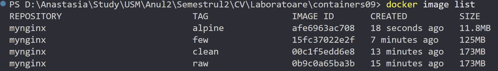
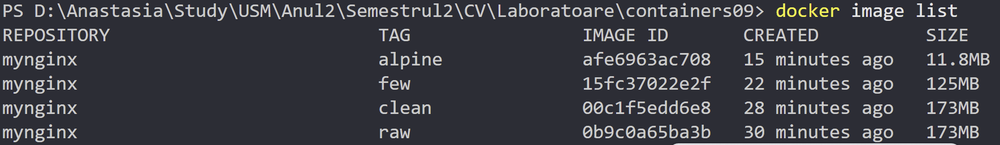

# containers09

## Scopul lucrării

Scopul lucrării este de a ne familiariza cu metodele de optimizare a imaginilor. Familiarizarea cu metodele de optimizare a imaginilor Docker pentru a reduce dimensiunea și a îmbunătăți performanța aplicației.

## Sarcina

## Efectuarea lucrării

### Descrierea lucrului cu Git-ul

1. M-am conectat la contul meu de GitHub.
2. Am dat click pe "New repository".
3. Am denumit repository-ul, am bifat să fie inițializat cu un fișier nou `README.md` și l-am creat.
4. Am clonat repository-ul în Visual Studio (VS) Code:

   - `git clone https://github.com/anastasiaCazacu/containers09.git` - clonez repository-ul.
   - `cd containers09` - accesez folderul clonat.
   - `git checkout -B lab09` - creez branchiul si ma mut pe el si modific fisierul meu README.MD si ulterior doar adaug continutul.
   - `git add *` - adaug tot continutul.
   - `git status` - verific statutul si ma asigur ca am modificarile dorite.
   - `git commit -m "structure defined"` - creez commitul
   - `git push origin lab09` - push commit în depozitul de la distanță
   - `git checkout main`- Comut pe branch-ul principal
   - `git merge lab09`- Integrez (merge) branch-ul nou în main.
   - `git push origin main` - Împing schimbările pe GitHub.

   ### Descrierea efectuarii lucrarii

Realizez structura si cu continutul propus pas cu pas:

```txt
containers09/
├── Dockerfile.raw
├── Dockerfile.clean
├── Dockerfile.few
├── Dockerfile.alpine
├── Dockerfile.min
├── site/
│ ├── index.html
│ ├── style.css
│ └── script.js
```

- Creez `Dockerfile.raw` si rulez, construesc imaginea cu numele mynginx:raw:: `docker image build -t mynginx:raw -f Dockerfile.raw .`.

- Elimin fișierele temporare și dependențele neutilizate în `Dockerfile.clean`. Asamblez imaginea cu numele mynginx:clean și verific dimensiunea: `docker image build -t mynginx:clean -f Dockerfile.clean .`, `docker image list`.

- Minimizez numărul de straturi în `Dockerfile.few` cu continutul propus. Construesc imaginea cu numele mynginx:few și verific dimensiunea:

`docker image build -t mynginx:few -f Dockerfile.few .`
`docker image list`


- Reaalizez utilizarea unei imagini de bază minime: Înlocuesc imaginea de bază cu `alpine` în `Dockerfile.alpine` cu continutul propus. Construesc imaginea cu numele `mynginx:alpine` și verificați dimensiunea:

`docker image build -t mynginx:alpine -f Dockerfile.alpine .`
`docker image list`


- Reambalez imaginile (repack):

`docker container create --name mynginx mynginx:raw`
`docker container export mynginx | docker image import - mynginx:repack`
`docker container rm mynginx`
`docker image list`. 

- Utilizarea tuturor metodelor: Creez imaginea mynginx:minx utilizând toate metodele de optimizare. Pentru aceasta definesc următorul `Dockerfile.min` cu continutul propus:

```bush
docker image build -t mynginx:minx -f Dockerfile.min .
docker container create --name mynginx mynginx:minx
docker container export mynginx | docker image import - myngin:min
docker container rm mynginx
docker image list
```

```bush
mynginx                            minx               e84871716d81   About a minute ago   9.28MB
mynginx                            alpine             afe6963ac708   23 minutes ago       11.8MB
mynginx                            few                15fc37022e2f   30 minutes ago       125MB
mynginx                            clean              00c1f5edd6e8   36 minutes ago       173MB
mynginx                            raw                0b9c0a65ba3b   38 minutes ago       173MB
```

### Raspunsul la intrebarile propuse:

1. Care metodă de optimizare a imaginilor vi se pare cea mai eficientă?

- Utilizarea imaginii de bază minime (Alpine) este, în general, cea mai eficientă metodă pentru a optimiza dimensiunea imaginii Docker. Imaginile Alpine sunt mult mai mici decât cele bazate pe Ubuntu sau alte distribuții, ceea ce reduce semnificativ dimensiunea finală a imaginii. De asemenea, Alpine vine cu un set minim de pachete preinstalate, astfel încât putem adăuga doar dependențele necesare, fără a include fișiere suplimentare care nu sunt esențiale

2. De ce curățirea cache-ului pachetelor într-un strat separat nu reduce dimensiunea imaginii?

- Curățarea cache-ului pachetelor într-un strat separat nu va reduce dimensiunea imaginii, deoarece fiecare comandă RUN în Dockerfile creează un strat nou în imagine. Chiar dacă se curăță cache-ul, acel strat care conține cache-ul și fișierele temporare va fi păstrat în imagine. Pentru a optimiza corect dimensiunea, ar trebui să combinăm pașii de instalare a pachetelor și curățarea cache-ului într-o singură comandă `RUN`, astfel încât să nu fie creat un strat suplimentar pentru curățare.

3. Ce este repachetarea imaginii?

- Reambalarea imaginii (sau repachetarea imaginii) este procesul de exportare unui container și importarea sa într-o imagine nouă. În acest proces, containerul este creat pe baza imaginii existente, iar conținutul containerului este exportat ca o arhivă (de obicei tar) care poate fi utilizată pentru a crea o imagine nouă. Această metodă poate ajuta la optimizarea imaginii, eliminând anumite fișiere temporare sau istoricul straturilor anterioare care nu mai sunt necesare. Astfel, putem obține o imagine "curată", cu dimensiuni mai mici.

## Concluzie

Optimizarea imaginilor Docker este esențială pentru:

1. Reducerea spațiului de stocare

2. Creșterea vitezei de încărcare

3. Securitate mai bună (imagini mai mici, mai puține dependențe)

Cea mai eficientă metodă s-a dovedit a fi folosirea imaginii Alpine împreună cu curățarea cache-urilor și reambalarea imaginii.
